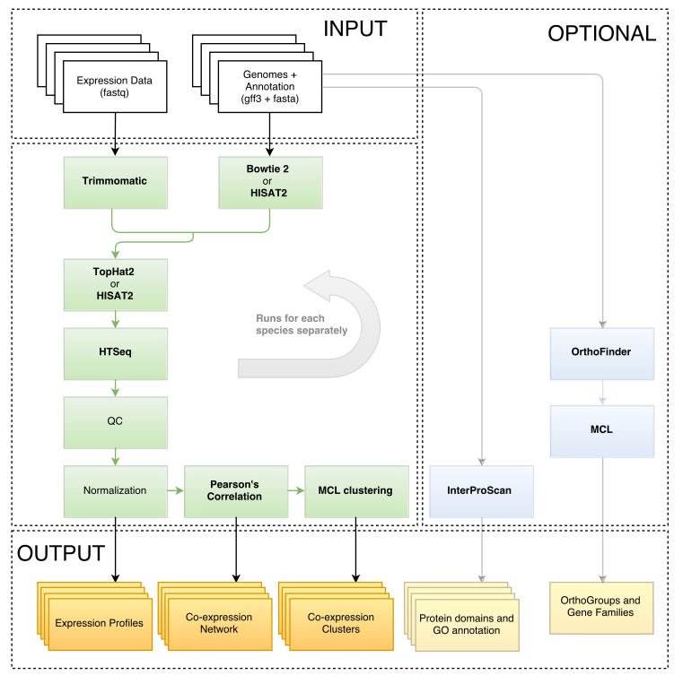

# LSTrAP

LSTrAP, shot for Large Scale Transcriptome Analysis Pipeline, greatly facilitates the construction of co-expression networks from
RNA Seq data. The various tools involved are seamlessly connected and  CPU-intensive steps are submitted to a computer cluster 
automatically. 

## Workflow

LSTrAP wraps multiple existing tools into a single workflow. To use LSTrAP the following tools need to be installed

Steps in bold are submitted to a cluster.

## Preparation

LSTrAP is designed to run on an [Oracle Grid Engine](https://www.oracle.com/sun/index.html) computer cluster system and requires 
all external tools to be installed on the compute nodes. The "module load" system is supported. A comprehensive list of all tools 
necessary can be found  [here](docs/preparation.md)

## Installation

Use git to obtain a copy of the LSTrAP code

    git clone https://github.molgen.mpg.de/proost/LSTrAP

Next, move into the directory and copy **config.template.ini** and **data.template.ini**

    cd LSTrAP
    cp config.template.ini config.ini
    cp data.template.ini data.ini

Configure config.ini and data.ini using the guidelines below

## Configuration of LSTrAP

After copying the templates, **config.ini** needs to be set up to run on your system. It requires the path to Trimmomatic's jar and the
modules where Bowtie, Tophat ... are installed in.

The location of the transcriptome data, the refrence genome and a few per-species options need to be defined in **data.ini**. 

Detailed instruction how to set up both configuration files can be found [here](docs/configuration.md)

## Running LSTrAP

Once properly configured for your system and data, LSTrAP can be run using a single simple command (that should be executed on the head node)

    ./run.py config.ini data.ini

Options to skip certain steps of the pipeline are included, use the command below for more info

    ./run.py -h

## Quality report

After running LSTrAP a log file (*lstrap.log*) is written, in which samples which failed a quality measure
are reported. Note that no samples are excluded from the final network. In case certain samples need to be excluded
from the final network remove the htseq file for the sample you which to exclude and re-run the pipeline skipping all
steps prior to building the network.

    ./run.py config.ini data.ini --skip-interpro --skip-orthology --skip-bowtie-build --skip-trim-fastq --skip-tophat --skip-htseq --skip-qc

More information on how the quality of samples is determined can be found [here](docs/quality.md).

## Helper Scripts

LSTrAP comes with a few additional scripts to assist users to download and process data from the [Sequence Read Archive](http://www.ncbi.nlm.nih.gov/sra),
repeat analyses and the case study reported in the manuscript.

Details for each script can be found [here](docs/helper.md)

## Contact

LSTrAP was developped by [Sebastian Proost](mailto:proost@mpimp-golm.mpg.de) and [Marek Mutwil](mailto:mutwil@mpimp-golm.mpg.de) at the [Max-Planck Institute for Molecular Plant Physiology](http://www.mpimp-golm.mpg.de/2168/en)

This work is supported by [ERA-CAPS](http://www.eracaps.org/) though the [EVOREPRO](http://www.evorepro.org/) project.
