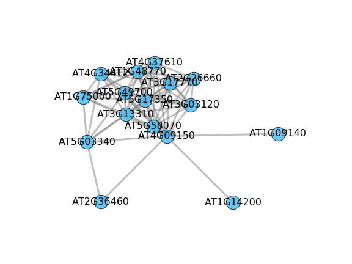

# Additional scripts

Scripts used to perform analyses reported in the LSTrAP manuscript (Proost et al., *under preparation*) are found in 
*./helper*

## Obtain and prepare data

### get_sra_ip.py

Script to download runs from [Sequence Read Archive](http://www.ncbi.nlm.nih.gov/sra), requires the Aspera connect 
client to be installed and a open ssh key is required (can be obtained from the Apera connect package)
 
    python3 get_sra_ip.py runs.list.txt ./output/directory /absolute/path/to/opensshkey
     
### sra_to_fastq.py

Script to convert sra files into fastq. Sratools is required.

    python3 sra_to_fastq.py /sra/files/directory /fastq/output/directory

## Running LSTrAP on transcriptome data

To use LSTrAP on a *de novo* assembled transcriptome, a little pre-processing is required. Instead of the genome, a fasta 
file containing **coding** sequences can be used (remove UTRs). Using the helper script fasta_to_gff.py, a gff file suited
for LSTrAP can be generated.

### parse_gff.py

Script to remove splice variants from a GFF3 file, the longest one is retained.

    # print to STDOUT
    python3 parse_gff.py input.gff
     
    # write to file
    python parse_gff.py input.gff -o output.gff
    python parse_gff.py input.gff --output output.gff 

## Quality control

### htseq_count_stats.py, hisat2_stats.py and tophat_stats.py

These scripts will extract the statistics used to assess the quality of samples. 

    python3 htseq_count_stats.py ./path/to/htseq/files > output.txt
    python3 tophat_stats.py ./path/to/tophat/output > output.txt
    python3 hisat2_stats.py ./path/to/hisat2/output > output.txt

## Plots and Graphs

Scripts to generate images similar to those presented in the publication. Example data, 
derived from the *Sorghum bicolor* case study, is included in the repository. 

### plot_network.py

Script that plots the co-expression neighborhood for a specific gene. A PCC cutoff of 0.7 is included by default,
but users can override this setting using the --cutoff parameter. Matplotlib and networkx are required for this
script.

    # To draw plot to screen using a PCC cutoff of >= 0.8
    python3 plot_network.py <PCC_TABLE> <GENE_ID> --cutoff 0.8

    # Save as png
    python3 plot_network.py <PCC_TABLE> <GENE_ID> --cutoff 0.8 --png output.png
    
    # Set png dpi (for publication)
    python3 plot_network.py <PCC_TABLE> <GENE_ID> --cutoff 0.8 --png output.png --dpi 900

### matrix_heatmap.py
    
Script to draw a sample distance heatmap (with hierarchical clustering) based 
on a normalized expression matrix.  
    
    # To draw plot to screen
    python3 matrix_heatmap.py ./data/sbi.expression.matrix.tpm.txt 
    
    # Hide labels (useful for large sets)
    python3 matrix_heatmap.py ./data/sbi.expression.matrix.tpm.txt --hide_labels
    
    # Save as png
    python3 matrix_heatmap.py ./data/sbi.expression.matrix.tpm.txt --png output.png
    
    # Set png dpi (for publication)
    python3 matrix_heatmap.py ./data/sbi.expression.matrix.tpm.txt --png output.png --dpi 900

")

### pca_plot.py

Script to perform a PCA analysis on any expression matrix.

    python3 pca_plot.py ./data/sbi.expression.matrix.tpm.txt
    
### pca_powerlaw.py

*This script and the required data are included to recreate results from the manuscript (Proost et al., under review)*

Script to perform a PCA analysis on the *Sorghum bicolor* data (case study) and draw the node degree distribution. The
required data is included here as well. Note that this script requires sklearn and seaborn.

    python3 pca_powerlaw.py ./data/sbi.expression.matrix.tpm.txt ./data/sbi_annotation.txt ./data/sbi.power_law.R07.txt
    

    
